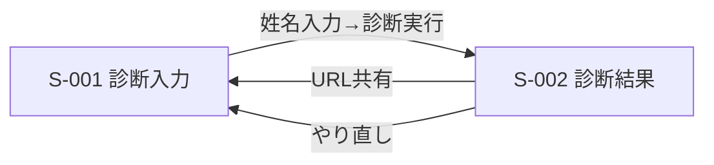

# 画面一覧・遷移

## 画面一覧

| 画面ID | 名称 | ロール | 対応機能ID | Phase |
|--------|------|--------|-----------|-------|
| S-001 | 姓名診断 入力画面 | 全ユーザー | F-001, F-013 | 1（MVP） |
| S-002 | 姓名診断 結果画面 | 全ユーザー | F-001, F-006, F-009, F-010, F-012, F-013, F-014 | 1（MVP） |
| S-003 | ペット命名提案 入力画面 | 全ユーザー | F-002〜F-005 | 2 |
| S-004 | ペット命名候補 結果画面 | 全ユーザー | F-002, F-006, F-009, F-010, F-011 | 2 |

## 画面遷移（Phase1）

## S-001 姓名診断 入力画面
- 表示: 姓・名の入力欄、**性別セレクタ（未指定／男性／女性・任意）**、診断実行ボタン
- 操作: 入力後ボタン押下で診断実行（10秒程度のプログレス表示を許容）
- 性別（F-013）: 画数の計算には影響しない旨を注記で明示。一部の画数の吉凶の見方にのみ反映される
- バリデーション: 未入力時は実行不可。使用不可文字（数字・記号・英字等）は入力時にエラー表示
- 空状態: 初回アクセス時は入力欄が空・性別は未指定
- **生年月日（任意・F-015／未実装）**: 日付入力欄を追加。入力すると四柱推命の考え方で**用神（吉となる五行）**を求め、S-002 に参考表示する。**未入力でも従来どおり診断可能**。補足文言例「入力すると、生まれ持った五行のバランスを、姓名判断の結果とあわせて参考表示します（四柱推命の考え方）。空欄でもご利用いただけます。」
- **出生時刻・出生地（いずれも任意・F-015／未実装）**: **折りたたみ内**に配置。出生地は都道府県セレクタ（緯度経度の入力は不要）
- **入力レベルは積み上げ式**（L1: 生年月日のみ＝三柱／L2: ＋出生時刻＝四柱／L3: ＋出生地＝時差補正あり）。**生年月日だけで判定が完了できること**。未入力項目を勝手に補完しない（「正午」「東京」等とみなさない）。各レベルで「出生時刻の入力があると、より詳しく計算できます」等の注記を出す

## S-002 姓名診断 結果画面
- 表示: 総合点・ランク（SS〜C）を即時表示。続けて **各格の詳細カード**（F-014）と **三才配置（五行）** を表示。さらにLLM解説コメント（F-012）を非同期で表示（読み込み中は「コメント生成中…」のプレースホルダー）
- 各格の詳細カード（F-014）: 天→人→地→外→総の各格について、画数・吉凶バッジ（大吉/吉/半吉/凶）・役割・画数の象意キーワードと短評を表示。女性の注意数に該当する格には注記（伝統的な見方と現代的な見直しを併記）を表示
- 三才配置: 天・人・地の五行（木火土金水）と相生・相剋の関係、総合吉凶、要約を表示
- 操作: 「ファイルに保存」（F-009）、「クリップボードにコピー」（F-010）、「もう一度診断する」（S-001へ戻る）
- URL共有: 診断条件（姓・名・性別）をURLパラメータ（`sei`/`mei`/`sex`）に埋め込み、そのURLに直接アクセスした場合も同じ結果を再現する（F-006）。LLMコメントはURLに保存せず、アクセスの都度再生成する（非決定的な出力のため、同じURLでも文面が変わり得る）。**生年月日はプライバシー上URLに含めない**ため、共有URLでは五行突合ブロックは表示されない（F-015・仕様）
- **五行ボーナスブロック（F-015／未実装）**: 生年月日の入力があった場合のみ、**総合ランクの枠外に独立ブロック**として表示（スコアに影響しないことが見た目で分かる配置）。
  - 見出し「**四柱推命による五行ボーナス**」＋由来バッジ「生年月日から算出（四柱推命）」で、**四柱推命由来であることを明示**する
  - 評価は**3段階の言葉＋星**（★★★=十分に補えています／★★☆=やや補えています／★☆☆=補えていません）。**0〜100の数値は出さない**（既存の「言葉が主役・点数は参考値」方針に合わせ、総合点と競合させないため）
  - 内容: **用神（あなたにとって吉となる五行）**・名前が持つ五行（総格＋三才）・要約の一文。★☆☆ のときは前向きな一言を添える
  - 用神は身強／身弱の判定に基づく（身弱＝支える五行／身強＝抑える五行）。「少ない五行を補う」とは限らない点に注意
  - 計算に使った入力レベル（L1〜L3）を明示し、上位レベルがある場合は案内を出す
  - **注釈文を必須表示**: 「※四柱推命の考え方にもとづく参考情報です。上の姓名判断の結果（総合ランク・各格）には影響しません。生年月日は保存されません。」
  - 出生時刻未入力時は「出生時刻の入力があると、より詳しく計算できます。」を併記
  - **共有URLで開いた場合は表示されない**旨も明示
- エラー時: 該当文字がkanjiapi.devにも存在しない場合、診断不可メッセージを表示し、S-001に戻れるようにする
- LLMコメント失敗時: Ollama・OpenRouterとも応答不可の場合、コメント領域は非表示にし、診断結果本体の表示に影響を与えない

## 画面切替（Phase2で追加）
- トップに **タブ**（「姓名診断」／「ペットの名づけ」）を設置。`?mode=pet` で初期タブを指定可能。

## S-003 ペット命名提案 入力画面（Phase2・実装済）
- 表示: 対象動物（犬／猫／小動物）、性別（重視）、雰囲気カテゴリ（複数選択チップ・`/api/suggest` GETで取得）、使いたい文字、希望よみ、出力文字種（複数選択・未選択なら全部）
- バリデーション: 使いたい文字に漢字を含むのに出力文字種が漢字を許可しない場合はエラー表示（`INVALID_INPUT`）

## S-004 ペット命名候補 結果画面（Phase2・実装済）
- 表示: スコア順の候補カード（名前・よみ・画数・吉凶バッジ・推薦理由チップ）。各候補にLLMコメント（F-011）を**非同期**で付与（一覧はコメント生成を待たず表示。読み込み中は「コメント生成中…」）。動的生成候補には「よみから生成」タグ
- 操作: 「一覧をファイルに保存」「一覧をコピー」（読み・画数・吉凶・理由・コメントを含む）
- 空状態: 条件に合う候補が0件の場合、条件緩和を促すメッセージを表示
