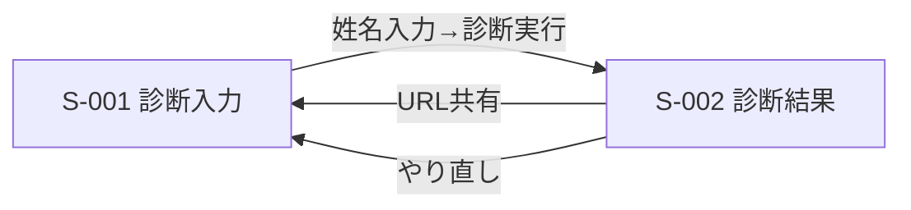

# 画面一覧・遷移

## 画面一覧

| 画面ID | 名称 | ロール | 対応機能ID | Phase |
|--------|------|--------|-----------|-------|
| S-001 | 姓名診断 入力画面 | 全ユーザー | F-001 | 1（MVP） |
| S-002 | 姓名診断 結果画面 | 全ユーザー | F-001, F-006, F-009, F-010, F-012 | 1（MVP） |
| S-003 | ペット命名提案 入力画面 | 全ユーザー | F-002〜F-005 | 2 |
| S-004 | ペット命名候補 結果画面 | 全ユーザー | F-002, F-006, F-009, F-010, F-011 | 2 |

## 画面遷移（Phase1）

## S-001 姓名診断 入力画面
- 表示: 姓・名の入力欄、診断実行ボタン
- 操作: 入力後ボタン押下で診断実行（10秒程度のプログレス表示を許容）
- バリデーション: 未入力時は実行不可。使用不可文字（記号等）はエラー表示
- 空状態: 初回アクセス時は入力欄が空の状態

## S-002 姓名診断 結果画面
- 表示: 総合点・ランク（SS〜C）、五格の内訳（天格・人格・地格・外格・総格）を即時表示。続けてLLM解説コメント（F-012）を非同期で表示（読み込み中は「コメント生成中…」のプレースホルダー）
- 操作: 「ファイルに保存」（F-009）、「クリップボードにコピー」（F-010）、「もう一度診断する」（S-001へ戻る）
- URL共有: 診断条件をURLパラメータに埋め込み、そのURLに直接アクセスした場合も同じ結果を再現する（F-006）。LLMコメントはURLに保存せず、アクセスの都度再生成する（非決定的な出力のため、同じURLでも文面が変わり得る）
- エラー時: 該当文字がkanjiapi.devにも存在しない場合、診断不可メッセージを表示し、S-001に戻れるようにする
- LLMコメント失敗時: Ollama・OpenRouterとも応答不可の場合、コメント領域は非表示にし、診断結果本体の表示に影響を与えない

## S-003 ペット命名提案 入力画面（Phase2）
- 表示: 対象動物（犬／猫／小動物）、性別、希望カテゴリ、使いたい文字（カンマ・スペース区切り入力）、希望よみがな、出力文字種選択
- バリデーション: 使いたい文字と出力文字種が矛盾する場合はエラー表示（例: 出力＝ひらがなのみ、だが漢字を指定）

## S-004 ペット命名候補 結果画面（Phase2）
- 表示: スコア順の候補名リスト。各候補にLLMコメント（F-011）を付与
- 操作: 「ファイルに保存」「クリップボードにコピー」「条件を変えて再検索」（S-003へ戻る）
- 空状態: 条件に合う候補が0件の場合、条件緩和を促すメッセージを表示
