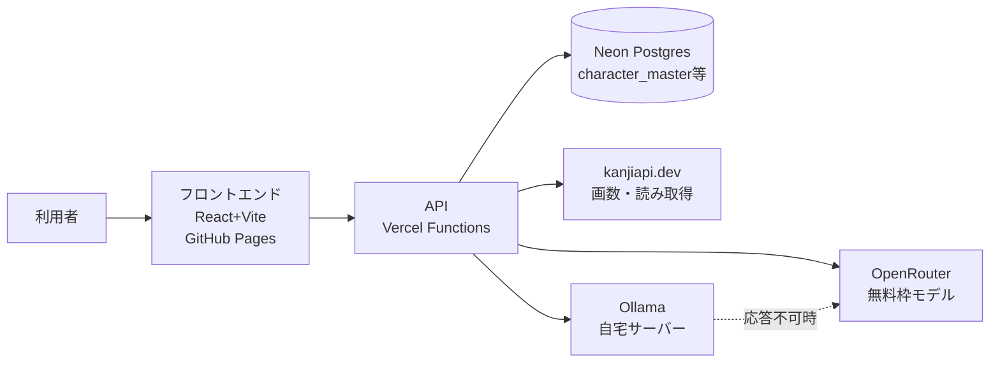

# 基本設計サマリ

## 1. 文書情報

| 項目 | 内容 |
|------|------|
| 文書名 | 命名サービス 基本設計サマリ |
| 版数 | 1.6 |
| 作成日 | 2026-07-17 |
| 元にした要件定義書 | 命名サービス_要件定義書.md（v1.11） |
| 元にしたデータ構造設計 | 命名サービス向けデータ構造設計.md（v11） |

## 2. 全体構成

フロントエンド（GitHub Pages）とAPI（Vercel Functions）を分離し、DBはNeon（Postgres無料枠）を利用する。将来的にOCI VPSへ移行する際も標準的なPostgresであるため移行しやすい構成とした。

## 3. 主要な設計判断と根拠

| 項目 | 決定 | 理由 | 区分 |
|------|------|------|------|
| フロントエンド | React + Vite + TypeScript | GitHub Pagesでの静的ホスティングに適し、TypeScriptで型安全性を確保 | 【想定】 |
| バックエンド | Vercel Functions（Node.js + TypeScript） | 要件定義書のホスティング方針（Vercel）に準拠 | 確定（要件定義書由来） |
| DB | Neon（Postgres無料枠） | Vercel Functionsはファイルシステムが非永続のためSQLite等は不向き。標準Postgresで将来のOCI移行も容易 | 【想定】 |
| 実装AIツール | Claude Code | ユーザー指定のため、実装指示書は `CLAUDE.md` として出力 | 確定 |
| MVP範囲 | 姓名診断（F-001）＋そのLLMコメント生成（F-012） | ユーザー指定。ロジック計算結果をLLMで解説・肉付けする形にし、フェーズ2のLLM基盤を前倒しで構築する | 確定 |
| LLMコメントの表示方式 | 診断結果は即時表示、LLMコメントは非同期で後から表示 | ロジック計算とLLM生成の速度差を吸収し、体感速度を落とさないため | 【想定】 |
| 読み逆引きデータ | 自前テーブルを持たずkanjiapi.devを都度呼び出し | 要件定義書・データ構造設計で確定済み | 確定（前工程から継承） |
| LLM構成 | Ollama（自宅サーバー）優先、OpenRouterへフォールバック、順序・モデルは環境変数で変更可能 | 要件定義書で確定済み | 確定（前工程から継承） |
| 姓名判断の流派 | 熊崎式。将来複数流派に対応できる構造で実装するが、Phase1は熊崎式のみハードコード | 最も普及している流派。将来の拡張性は確保しつつMVPはシンプルに保つ | 確定（前工程から継承） |
| 熊崎式部首補正の洗い出し方法 | Kanji alive API（第一候補）＋MuzukanjiAPI（第二候補、Kanji alive対応外を埋める）から部首情報を取得し、「部首→補正値」対応表と突き合わせて半自動化。いずれもビルド時のシードデータ生成スクリプトでのみ使用 | 全漢字の目視確認を避け、作業を小さな対応表作成に圧縮できるため | 確定（MuzukanjiAPIの実際の仕様はT-003着手時に検証） |

## 4. 要件との対応（トレーサビリティ）

`docs/tasks.md` 冒頭のトレーサビリティ表を参照。要件定義書の全機能ID（F-001〜F-012）が画面・API・データ・タスクに対応付けられている。F-008（アカウント機能）のみ対象外として明示的に除外。

## 5. フェーズ分割

- **フェーズ1（MVP）**: 姓名診断（F-001）＋結果共有（F-006）＋ファイル出力／クリップボードコピー（F-009, F-010）＋未知文字フォールバック（F-007）＋診断結果へのLLMコメント生成（F-012、Ollama→OpenRouterフォールバック基盤を含む）
- **フェーズ2**: ペット命名提案一式（F-002〜F-005）＋LLMコメント生成（F-011、フェーズ1で構築した基盤を再利用）

## 6. 残る要確認事項（設計段階）

Phase1着手前の主要な設計判断はすべて確定した（要件定義書v1.11時点）。残るのは将来対応・低優先度の事項のみ。

| No | 確認事項 | 確認先 | 設計影響 |
|----|----------|--------|----------|
| 1 | ローマ字出力時のかな変換・画数代用評価の変換ルール | gerupon | 後で可（Phase2着手時） |
| 2 | 将来のアカウント機能導入時の認証方式 | gerupon | 後で可（現スコープ外） |
| 3 | Ollama側で `gemma4:31b-cloud` の他モデルへの切替検討 | gerupon | 後で可（運用しながら判断） |
| 4 | 熊崎式の「部首→補正値」対応表の作成（Kanji alive・MuzukanjiAPIの部首情報で半自動化、10〜20件程度を想定） | gerupon | 後で可（T-003着手時に作成すればよい、小さく閉じた作業） |
| 5 | MuzukanjiAPIの実際のレスポンス形式・無料枠上限の確認 | gerupon | 後で可（T-003着手前に一度試せばよい） |

内容を確認いただき、認識齟齬があれば教えてください。問題なければこのままフェーズ1（姓名診断＋F-012）の実装に着手できます。
