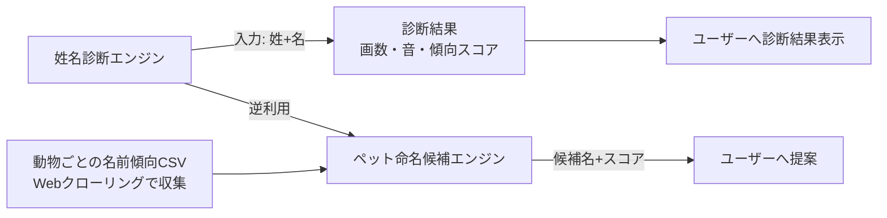

# 構想たたき台: 姓名診断アプリ＋ペット命名提案機能

| 作成日 | 作成者 | 状態 |
|--------|--------|------|
| 2026-07-13 | gerupon | 構想段階（フィードバック募集中） |

> ⚠ この資料は思いつき段階のたたき台です。【想定】は作成者の仮置き、【要確認】は未確定事項を示します。

## 1. 一言でいうと

姓名から吉凶・傾向を診断するWebアプリを作り、その診断ロジックを逆向きに使って「良い名前になるペットの名前候補」を提案する機能も併せて提供する。

## 2. 背景・課題

姓名診断（いわゆる姓名判断）は、名前を入力すると画数や音の響きなどから運勢や性格傾向を占う、日本で馴染みのあるコンテンツ。作成者はこの診断ロジックを実装したアプリを作ってみたいと思いつき、さらに「診断できるなら、逆に“良い診断結果になる名前”を提案できるのでは」という発想から、ペットの命名支援機能というアイデアに発展した。

【想定】命名は人生の節目（子どもの命名、ペットを迎えるとき）で悩む人が多く、既存の姓名判断サイトの多くは「診断」機能はあっても「良い名前を提案してくれる」機能は少ない。この非対称性がアイデアの面白さの核。

## 3. 提案するアイデア

1. **姓名診断機能**: ユーザーが姓名を入力すると、画数や響きなどのロジックで診断結果を表示する。
2. **ペット命名提案機能**: 診断ロジックを「良いスコアになる名前を探索する」方向に逆利用し、動物種ごとの名前の傾向データ（CSV）と掛け合わせて、現実的で診断的にも良い候補名をいくつか提示する。

## 4. 想定ユーザーと利用シーン

【想定】想定ユーザーは特定の職業層ではなく、一般の個人ユーザー（無料で気軽に使う層）。

- シーン例1: 新しく子猫を迎えることになった人が、アプリで「猫、姓名診断的に縁起の良い名前」を検索し、候補リストから気に入った名前を選ぶ。
- シーン例2: 自分の名前を診断してみて面白がり、SNSでシェアする。

## 5. 主要機能の候補

| 機能 | 概要 | 優先度（ラフ） |
|------|------|----------------|
| 姓名診断（人間向け） | 姓名を入力→画数・音などから診断結果を表示 | 核 |
| ペット命名候補提案 | 動物種を選択→診断ロジックで良好なスコアの名前候補をリスト表示 | 核 |
| 動物種ごとの名前傾向データ収集（クローリング→CSV） | 犬・猫・小動物数種を対象に、実際によく使われる名前とその特徴をWebから収集しCSV化 | 核 |
| 診断結果のシェア機能（SNS等） | 診断結果や命名候補を画像・リンクでシェア | あれば |
| LLMによる名前の意味・由来コメント生成 | OpenRouter APIまたはローカルLLM（Ollama等）で候補名に一言コメントを付与 | あれば |
| 診断ロジックの複数方式切替（画数系/音感系） | ユーザーが診断方式を選べるようにする | 将来 |
| 対応動物種の拡大（爬虫類・鳥類等） | MVP後、対象動物を増やす | 将来 |

## 6. 実現方式の選択肢

<松竹梅で3案。1案に絞らない>

| 案 | 概要 | 良い点 | 気になる点 | ざっくり規模感 |
|----|------|--------|-----------|----------------|
| 松: 独自診断エンジン＋LLM併用フル開発 | 画数系ロジックを自前実装し、LLMで補助コメント・音感評価も加える。動物種ごとのクローリング基盤も自前構築 | 差別化しやすく、将来の拡張（動物種追加、方式追加）に強い | 開発期間が延び、クローリング先の選定・法的配慮など検討事項が多い【想定】 | 数週間〜数ヶ月【想定】 |
| 竹: 画数系ロジックのみ自前実装＋LLMは候補名コメント生成に限定 | 診断コアは伝統的な画数ロジックに絞り、LLMは候補名への一言コメントなど補助用途のみに限定してコストを抑える | 実装範囲が明確でコストも読みやすい。ユーザー質問で挙がった「まだ両方候補」の状態に一番近い | 音感系を求めるユーザーには物足りない可能性 | 数週間【想定】 |
| 梅: 既存の姓名判断ロジック（OSSやAPI）を利用し、ペット命名の逆引きロジックのみ自作 | 診断本体は既存実装/公開情報を参考にし、独自開発は「逆引き探索」と「動物名CSV」に集中 | 最速でMVPを出せる。GitHub Pages + Vercelという当初想定と相性が良い | 診断ロジックの独自性・精度が既存実装依存になる | 数日〜1週間【想定】 |

## 7. 期待効果とリスク・懸念

- 期待効果: 【想定】姓名診断＋ペット命名という組み合わせは類似サービスが少なく、SNSでの話題化・拡散が見込める。個人開発の実績・ポートフォリオとしても使える。
- リスク・懸念:
  - コストを抑えたいという要望があり、LLM利用はOpenRouter APIまたはOllamaローカルLLMを想定しているが、API従量課金の管理方法は未検討【要確認】。
  - 動物ごとの名前傾向をWebクローリングで収集する際、クローリング先サイトの利用規約・著作権への配慮が必要（法的観点は未検討）【要確認】。
  - 姓名判断は流派（画数の数え方、五格の定義など）が複数あり、「これが正解」という単一ロジックが存在しない点をどう扱うか【要確認】。

## 8. フィードバックをもらいたい点

1. 姓名診断のコアロジックは、伝統的な画数（五格）方式・音の響き方式のどちらを軸にすべきか、それとも両方式を並行実装すべきか？
   → 軸が決まると、6章の実現方式（松/竹/梅）のどれを選ぶべきかが定まり、開発規模も大きく変わる。
2. ペット命名候補のデータ源として、Webクローリングによる名前傾向CSV以外に、既存の「人気ペット名ランキング」等の公開データを併用してよいか？
   → クローリングのみに頼るとデータ収集の手間・法的リスクが増えるため、公開データ活用の可否で初期開発スピードが変わる。
3. LLM利用は「候補名への一言コメント生成」程度の補助用途に限定してよいか、それとも診断ロジック自体の一部（音感評価など）にもLLMを使いたいか？
   → 診断ロジック自体にLLMを使う場合、結果の再現性・一貫性の担保方法を別途設計する必要が生じる。

## 補助メモ（該当時のみ・requirements-definition への申し送り）

### 初回価値と重大な行き止まり

- 最初の成果: ユーザーが姓名（または動物種）を入力し、診断結果またはペット名候補リストを得ること。
- 到達を妨げる前提: 特になし（ログイン等の事前準備は不要と想定）【想定】。
- 安全な中断・復帰: 診断結果の保存・共有機能を設けるかは未定【要確認】。

### 要件定義で決めるライフサイクル

該当なし（予約枠のような数量・期限を持つリソースは現時点で想定されていない）。

### ルール交差

該当なし（現時点でロール・権限による利用可否の分岐は想定されていない）。

## 9. 未確定事項と次のステップ

- 【要確認】姓名診断のコアロジック方式（画数系／音感系／両方）
- 【要確認】動物ごとの名前傾向データの収集方法（クローリングのみか、公開データ併用か）とクローリング先の法的配慮
- 【要確認】LLM利用範囲（補助コメント生成のみか、診断ロジック自体への組み込みか）とAPIコスト管理方法
- 【要確認】診断結果・命名候補の保存/共有機能の要否
- 次のステップ: フィードバック反映 → 方向が固まったら要件定義（requirements-definition）へ

## 10. 決定ログ

| 項目 | 判断 | 理由 | 再検討の条件 |
|------|------|------|--------------|
| 対応動物種 | 初期版は犬・猫・小動物（うさぎ・ハムスター等）数種に絞る | クローリング・データ整備の手間を抑え、MVPを早く出す | 初期版が安定稼働したら爬虫類・鳥類等へ拡大 |
| 診断方式の複数化（画数系/音感系の切替） | 将来案として保留 | まずは1方式でコアの動作を検証する | 核となる診断ロジックが安定したら |
| SNSシェア機能 | 初期版では優先度「あれば」扱いとし必須にしない | 診断・命名候補の核機能を先に固める | 核機能のフィードバックが良好だったら |

## 11. 要件定義への引継ぎ

| 種別 | 項目 | 状態 | 次工程 |
|------|------|------|--------|
| コア体験 | 姓名を入力して診断結果を得る | 確定 | 要件定義 |
| コア体験 | 動物種を選んでペット命名候補を得る | 確定 | 要件定義 |
| データ基盤 | 動物ごとの名前傾向をWebクローリングでCSV化 | 確定 | 要件定義 |
| データ基盤 | クローリング先の選定・利用規約確認 | 【要確認】 | 要件定義 |
| ロジック | 診断のコア方式（画数系/音感系） | 【要確認】 | 要件定義 |
| LLM利用 | OpenRouter API／Ollamaローカルの使い分けと利用範囲 | 【要確認】 | 要件定義 |
| インフラ | GitHub Pages（フロント）+ Vercel（API/バックエンド）構成 | 確定 | 要件定義 |
| 対象範囲 | 初期対応動物種（犬・猫・小動物数種） | 確定 | 要件定義 |
| 拡張機能 | SNSシェア、診断方式の複数化、対応動物種拡大 | 【想定】後続 | 要件定義 |
